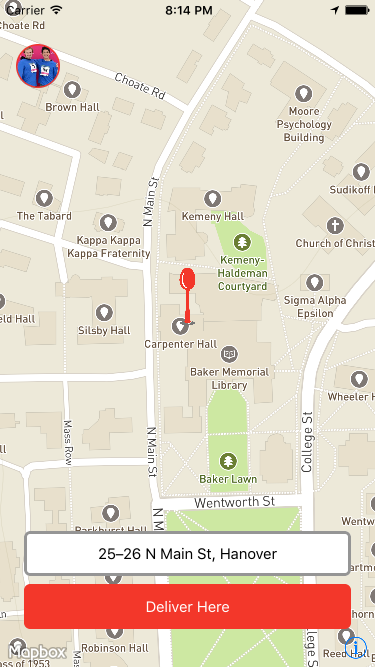

# PinPoint

PinPoint is a mobile app geared towards simplifying the food delivery process for all parties. The app has two components, one for the customer and driver. First, the customer calls a restaurant to place an order for delivery. The restaurant takes down the customer’s order as usual (order and phone number), but rather than taking down the customer’s address instead tells the customer to download PinPoint. Once installed, the app prompts the customer for their phone number. The app then retrieves the customer’s location and requests the customer’s payment information. Meanwhile, when the order is ready to be delivered, the driver takes the orders and enters the phone number on the orders. With the customer’s location information, the driver’s app creates a delivery route and provides navigation for the driver. Then, when a customer’s phone number is entered the app provides a delivery time estimate for the customer. Finally, as the driver arrives, the app notifies the customer and automates the payment process. 

## Setup
1. Clone repo: `git clone https://github.com/dali-lab/PinPoint`
1. Install CocoaPods: `sudo gem install cocoapods`
1. Install pods: `pod install`
1. Open up the project in XCode! (`./PinPoint.xcworkspace`)

## Key Files (get from a current developer)
  - twilio_keys.plist
  - mapbox_keys (not currently used)
